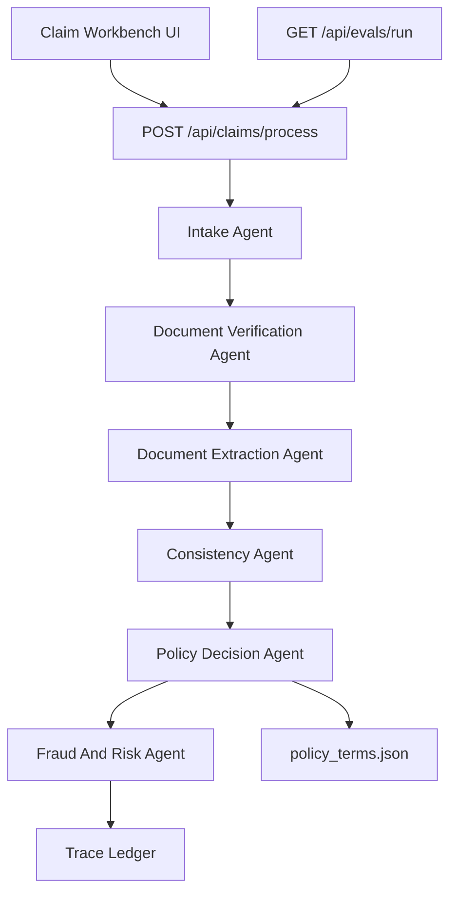

# Architecture

## Design Goal

This system is built as a trace-first claims decision cockpit. The core product promise is not only to return `APPROVED`, `PARTIAL`, `REJECTED`, or `MANUAL_REVIEW`, but to show exactly which document, policy, risk, and calculation checks produced that outcome.

The implementation intentionally separates probabilistic document understanding from deterministic policy adjudication. That gives the product room to use LLM/vision models for messy documents while keeping money movement explainable and testable.

## Components

## Request Flow

1. The UI submits a claim payload or one of the 12 assignment fixtures.
2. The intake agent validates the claim contract and confirms the member exists.
3. The document verification agent checks required document types before any claim decision is made.
4. The extraction agent normalizes document facts. In the assignment fixtures it uses structured metadata; in a production path this is where OpenAI vision/OCR extraction plugs in.
5. The consistency agent checks patient names, document agreement, and amount mismatches.
6. The policy engine applies exclusions, waiting periods, pre-authorization, financial rules, and item-level approvals.
7. The fraud/risk agent can route suspicious claims to manual review without auto-rejecting them.
8. Every component appends trace events with status, evidence, and confidence impact.

## Why This Shape

The assignment rewards system design, observability, and graceful failure more than clever prompting. A monolithic LLM decision would be hard to debug, flaky in evals, and risky for financial outcomes. This architecture uses deterministic code for policy and uses AI only where unstructured documents require it.

## Failure Handling

Components return typed outputs rather than throwing whenever possible. If extraction fails, the orchestrator records the failure, uses available document metadata, reduces confidence, and recommends manual review. Early document problems return `NEEDS_MEMBER_ACTION` with specific repair instructions instead of producing a false rejection.

## Scaling To 10x

At higher load, this design can evolve without rewriting the policy engine:

- Move document extraction to an async queue with retries and model fallback.
- Store original files in object storage and normalized facts in a database.
- Persist the trace ledger as an audit artifact for every decision.
- Version policy files and decision rules so historical claims can be replayed.
- Add a human review queue for `MANUAL_REVIEW` and degraded-confidence approvals.
- Cache policy/member data and split extraction workers from the Next.js API layer.

## Known Limitations

The current app is optimized for the assignment window. It does not include authentication, persistent claim storage, real file upload OCR, or a production human review workflow. The OpenAI adapter is intentionally isolated so it can be expanded without destabilizing the deterministic eval path.
